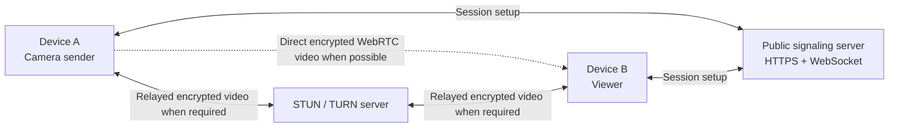

# Camera Forward

Forward a live camera stream from personal device **A** to an OBS Virtual Camera on company device **B**, even when the devices are on different local networks. The virtual camera can then be selected in a meeting application on B.

## Current status

The first working MVP is implemented:

- Browser camera sender for A
- OBS-friendly, full-canvas WebRTC receiver for B
- Node.js WebSocket signaling server
- Expiring, role-specific sender and viewer tokens
- Configurable STUN and TURN servers
- 1080p30 and 720p30 quality profiles
- H.264 preference, resolution-preserving adaptation, and sender statistics
- Automated session tests and an HTTP/WebSocket smoke test

## Quick start on one computer

Requirements: Node.js 22 or newer.

```bash
npm install
npm run dev
```

Open `http://localhost:3100`, select a quality profile, and click **Start camera session**. The displayed receiver URL can be opened in another browser tab for local testing.

The development command builds and starts the web UI and signaling API together:

- Web UI and signaling server: `http://localhost:3100`

This single-origin setup is the most reliable option across Windows, macOS, and Linux. Contributors who need Vite hot reload can use `npm run dev:hot` instead.

Camera access works on `localhost` without HTTPS. Accessing the development server through a LAN IP is not a supported cross-device setup because browsers normally require HTTPS for camera access.

## Use with OBS on B

1. Install OBS Studio and confirm that company policy allows its Virtual Camera component.
2. On A, open the deployed Camera Forward sender and click **Start camera session**.
3. Copy the generated **OBS Browser Source URL** to B. Treat the URL like a password.
4. In OBS on B, create a scene and add a **Browser** source.
5. Paste the receiver URL and set its width to `1920` and height to `1080`.
6. Set OBS Base (Canvas) and Output (Scaled) Resolution to `1920×1080`.
7. Set OBS Common FPS Value to `30` and avoid adding scaling or video filters.
8. Click **Start Virtual Camera** in OBS.
9. Open the meeting application on B and select **OBS Virtual Camera** as the camera.

The receiver status message disappears as soon as video is playing. OBS recording and streaming are not needed and should remain off.

## Production build

```bash
npm run build
npm start
```

The production server serves both the compiled web UI and WebSocket signaling on port `3000` by default. Put it behind an HTTPS reverse proxy on a public domain. The proxy must support WebSocket upgrades on `/ws`.

Copy `.env.example` to `.env` and configure infrastructure you control:

```dotenv
PORT=3000
SESSION_TTL_MINUTES=120
STUN_URLS=stun:stun.example.com:3478
TURN_URLS=turn:turn.example.com:3478?transport=udp,turns:turn.example.com:5349?transport=tcp
TURN_USERNAME=temporary-username
TURN_CREDENTIAL=temporary-password
```

For local testing, ICE servers may be omitted. For A and B on separate networks, deploy with both STUN and TURN. Production TURN credentials should be generated with short lifetimes rather than stored permanently in the frontend or repository.

## Verification commands

```bash
npm run typecheck
npm test
npm run build
```

With a built server running, its complete HTTP/WebSocket path can be checked using:

```bash
SMOKE_BASE_URL=http://localhost:3000 npm run smoke
```

## Goal

Build the fastest practical, high-quality, secure, one-way video connection:

- **Device A (sender):** captures video from its camera and publishes it.
- **Device B (viewer):** receives and displays A's live video.
- A and B do not need to be on the same Wi-Fi or LAN.
- End-to-end latency should be kept as low as possible without causing visible quality loss.
- The stream should use A's available upload bandwidth efficiently while retaining safety margin for network variation.
- Only an authorized viewer should be able to access the stream.
- The first version should work in modern desktop or mobile browsers without installing an app.

Audio, recording, multiple viewers, and native mobile applications are possible later, but are not required for the first version.

## Known network capacity

Device A's connection is currently understood to be:

- Download: approximately **15 Mbps**
- Upload: approximately **20 Mbps**

This document assumes that `M/s` means megabits per second (Mbps), as normally reported by an internet speed test. If the measurement is megabytes per second (MB/s), the available capacity is eight times greater.

The upload rate is the important number for A because A sends the video. The application should not reserve the entire measured 20 Mbps: speed-test results are temporary peaks, and the connection also needs capacity for WebRTC overhead, signaling, retransmissions, and other traffic. Start with a maximum video bitrate of **12 Mbps**, observe real-world stability, and increase toward **15 Mbps** only when tests show enough headroom.

B's download connection must also sustain the selected video bitrate. For the initial 12 Mbps ceiling, B should ideally have at least 15 Mbps of stable download capacity and low packet loss.

### Recommended initial video profile

| Setting | Initial value |
| --- | --- |
| Resolution | 1920×1080 |
| Frame rate | 60 fps when supported; otherwise 30 fps |
| Video codec | H.264 for broad compatibility; test VP9/AV1 where hardware support exists |
| Target bitrate | 8 Mbps |
| Maximum bitrate | 12 Mbps initially |
| Transport | WebRTC media over UDP whenever available |
| Viewers | One |

For a mostly static camera scene, 1080p30 at 5–8 Mbps may look excellent. Fast movement benefits from 1080p60 at roughly 8–12 Mbps. A fixed 4K stream is not recommended on a 20 Mbps upload connection because it leaves too little margin and is more likely to stall or lose frames.

“No quality loss” cannot be guaranteed over a variable internet connection: live codecs normally compress the camera signal, and packet loss or congestion may occur. The practical target is **no visible quality loss**, low latency, and no interruptions. An uncompressed 1080p60 camera feed would require far more than 20 Mbps and is outside this network's capacity.

## Recommended approach: WebRTC

Use **WebRTC** to send the camera stream. WebRTC provides low-latency video, congestion control, and encrypted media transport.

For this project, optimize WebRTC for speed by preferring UDP and a direct peer-to-peer route. Do not send video through the signaling server. Use TURN only as a connectivity fallback because a relay adds network distance and may add latency, although a nearby TURN server can still perform well.

Because A and B are behind different routers, they cannot usually connect using private IP addresses. They first meet through a public **signaling server**. WebRTC then attempts a direct peer-to-peer connection using STUN. If their routers or firewalls prevent a direct connection, a TURN server relays the encrypted stream.



## System components

### 1. Sender page (A)

- Requests camera permission with `navigator.mediaDevices.getUserMedia()`.
- Shows a local preview so the sender knows what is being shared.
- Creates an `RTCPeerConnection` and adds the camera video track.
- Applies explicit resolution, frame-rate, and bitrate constraints instead of relying entirely on browser defaults.
- Monitors outbound bitrate, packet loss, round-trip time, and encoded frame rate using `RTCPeerConnection.getStats()`.
- Sends its WebRTC offer and ICE candidates through the signaling server.
- Provides clear Start Sharing and Stop Sharing controls.

### 2. Viewer page (B)

- Joins the same private session using a short-lived link or room code.
- Creates an `RTCPeerConnection` and returns a WebRTC answer.
- Displays the remote stream in a `<video>` element.
- Shows connection state, reconnecting state, and useful errors.
- Reports the received resolution, frame rate, jitter, packet loss, and current latency.

### 3. Signaling server

- Creates private sessions and short-lived join tokens.
- Uses secure WebSockets (`wss://`) to exchange offers, answers, and ICE candidates.
- Verifies that clients are allowed to join a session.
- Does **not** carry video; it only coordinates the peers.

WebRTC does not define a signaling protocol, so a small JSON message format is sufficient for the MVP.

### 4. STUN/TURN server

- STUN discovers the public network address of each peer.
- TURN relays video when peer-to-peer connectivity is blocked.
- TURN is essential for reliable operation across corporate, carrier-grade NAT, and restrictive networks.

[coturn](https://github.com/coturn/coturn) is a common self-hosted TURN implementation. A managed TURN service can reduce initial operations work.

## Suggested MVP technology

- Frontend: TypeScript with a small web UI (plain Vite or a framework such as React)
- Signaling: Node.js, TypeScript, and WebSocket
- Media: browser WebRTC APIs
- NAT traversal: STUN plus TURN/coturn
- Deployment: a public server or cloud service with a domain name and TLS certificate

The web application must be served over HTTPS because browsers restrict camera access on insecure origins (except `localhost` during development).

For the lowest and most consistent latency, native sender software may ultimately outperform a browser by providing tighter control over camera capture, hardware encoding, codec settings, and buffering. The browser remains the fastest way to prove the architecture and measure whether native software is necessary.

## Connection flow

1. A opens the sender page and creates a private session.
2. The server returns a short-lived viewer link or room code.
3. A grants camera permission and starts sharing.
4. B opens the link and is authorized to join the session.
5. A creates a WebRTC offer and sends it through the signaling server.
6. B applies the offer, creates an answer, and sends it back.
7. Both peers exchange ICE candidates through the signaling server.
8. WebRTC selects a direct route, or falls back to TURN relay.
9. B receives A's encrypted live video.
10. Closing the session stops all camera tracks and invalidates its join token.

## Implementation plan

### Phase 1: same-network prototype

- Create sender and viewer pages.
- Capture A's camera and show its local preview.
- Implement a minimal WebSocket signaling server.
- Exchange WebRTC offer, answer, and ICE candidates.
- Display the stream on B.
- Test in two browser windows and then on two devices on the same LAN.

### Phase 2: different-network support

- Deploy the web and signaling services on a public HTTPS domain.
- Configure STUN and TURN credentials in `RTCPeerConnection`.
- Deploy coturn or connect a managed TURN service.
- Test with A on Wi-Fi and B on a mobile hotspot or cellular connection.
- Confirm both direct and TURN-relayed connections work.
- Place TURN in a region geographically close to A and B and compare its latency with the direct route.

### Phase 2.5: quality and latency tuning

- Measure actual sustained upload capacity at A at different times, rather than relying on one speed test.
- Begin with 1080p60, an 8 Mbps target, and a 12 Mbps maximum.
- Set the sender's degradation preference to preserve resolution when possible.
- Reduce frame rate before resolution when bandwidth briefly drops, if image detail is more important than motion smoothness.
- Test camera and browser hardware-encoding support for H.264, VP9, and AV1.
- Log WebRTC statistics without logging video or private network details.
- Measure glass-to-glass latency by showing a running timer to A's camera and comparing it on B.
- Tune using real packet-loss and latency measurements from the actual A and B networks.

### Phase 3: security and reliability

- Add short-lived, unguessable session IDs and signed join tokens.
- Require explicit approval on A before B can view the camera.
- Expire inactive sessions and revoke tokens when sharing stops.
- Add rate limiting, input validation, and origin checks to signaling.
- Use time-limited TURN credentials; never expose a permanent TURN password in frontend code.
- Add reconnect behavior, connection timeouts, and clear status messages.
- Avoid storing video or signaling payloads in logs.

### Phase 4: production features

- Add selectable resolution, frame rate, and camera device.
- Add optional audio and mute controls.
- Add stream health and bandwidth indicators.
- Add an automatic Quality mode and optional 1080p30/1080p60 manual modes.
- Add monitoring for signaling and TURN availability without recording media.
- Add end-to-end tests across representative network types.

## Repository layout

```text
cameraforward/
├── src/                     # Node.js signaling and session server
├── web/                     # Sender and OBS receiver pages
├── test/                    # Session manager tests
├── scripts/                 # Runtime smoke test
├── .env.example             # STUN/TURN configuration template
├── package.json
└── README.md
```

## MVP acceptance criteria

The MVP is complete when:

- A can start and stop camera sharing.
- B can join only with a valid, short-lived session link or code.
- B sees A's video with usable interactive latency.
- On a stable connection, B receives 1080p at the chosen frame rate without persistent frame drops or visible compression artifacts.
- The sender remains within its configured 12 Mbps initial video ceiling and adapts cleanly when available upload bandwidth falls.
- The connection works while A and B are on different local networks.
- The system automatically uses TURN when a direct path is unavailable.
- Media and signaling are encrypted in transit.
- Camera capture ends immediately when A stops sharing or closes the sender page.
- Errors such as denied camera access, invalid session, disconnected peer, and unavailable TURN service are understandable.

## Security and privacy rules

- Always show A when the camera is active and when a viewer is connected.
- Require A's knowledge and consent before every sharing session.
- Use HTTPS/WSS in every non-local environment.
- Treat session links like passwords and keep them short-lived.
- Authenticate signaling requests and authorize every room join.
- Do not expose internal IP addresses in application logs.
- Do not record or persist video unless a future recording feature has explicit user consent.
- Follow applicable privacy and surveillance laws wherever the software is used.

## Important trade-offs

- **Peer-to-peer WebRTC** minimizes server bandwidth, but it cannot connect through every firewall.
- **TURN relay** improves reliability, but its server carries the full video bandwidth and therefore has a real hosting cost.
- **Quality versus latency:** larger buffers and retransmissions can protect quality but increase delay. Real-time viewing should avoid building a long queue when the network becomes congested.
- **Resolution versus frame rate:** preserving resolution protects fine detail; preserving frame rate makes movement smoother. The appropriate priority depends on what the camera observes.
- **Codec choice:** newer codecs can produce better quality per bit, but software encoding may increase CPU use and latency. Hardware-accelerated H.264 is a strong baseline and should be compared with hardware-accelerated VP9 or AV1 on the actual devices.
- **One peer connection per viewer** is simple and suitable for one-to-one use. For many viewers, use an SFU media server such as LiveKit, mediasoup, or Janus instead of sending a separate stream from A to every viewer.
- **Browser capture** is the quickest MVP. A native application may later provide background operation, better device controls, and platform-specific reliability.

## Development milestones

1. Local camera preview on A.
2. WebSocket connection and private room creation.
3. WebRTC video between two local browser windows.
4. WebRTC video between two devices on one LAN.
5. Public HTTPS deployment with STUN.
6. TURN fallback and testing across separate networks.
7. Authentication, session expiry, sender approval, and operational monitoring.

## Non-goals for the first version

- Public broadcasting or discovery of cameras
- Cloud video recording
- More than one viewer per session
- Remote control of A's device
- Running the camera invisibly or without the sender's consent

## Next step

Run the local sender-to-receiver test, then deploy the service behind HTTPS and configure a geographically nearby TURN server. Cross-network testing with A on personal internet and B on the company network is the next milestone; the MVP is not production-ready until TURN fallback is verified through the company's firewall.
